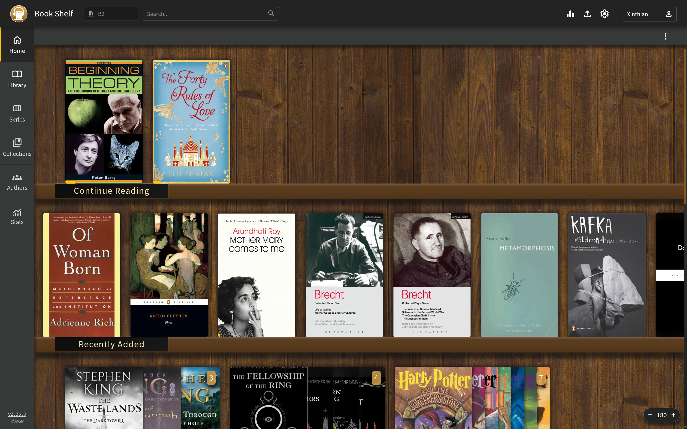
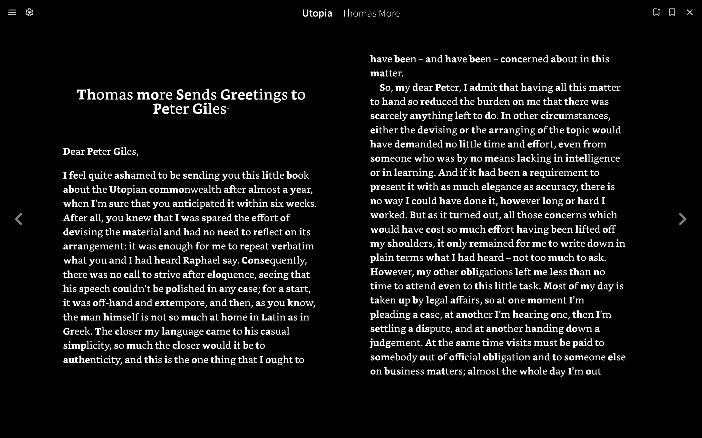
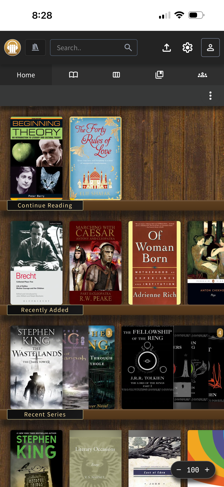
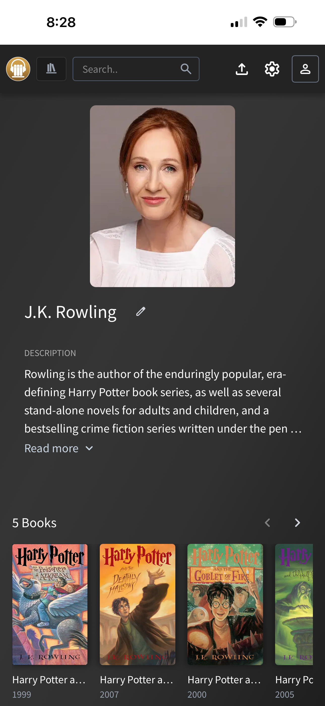
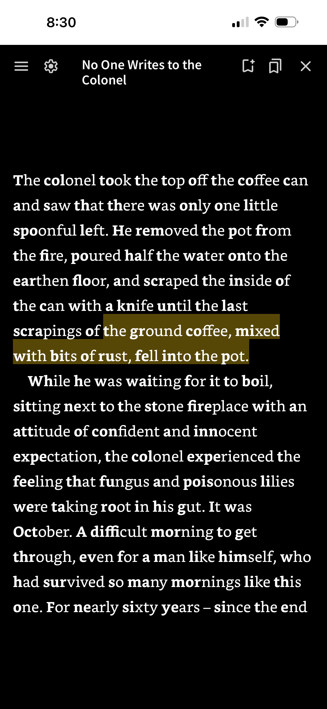
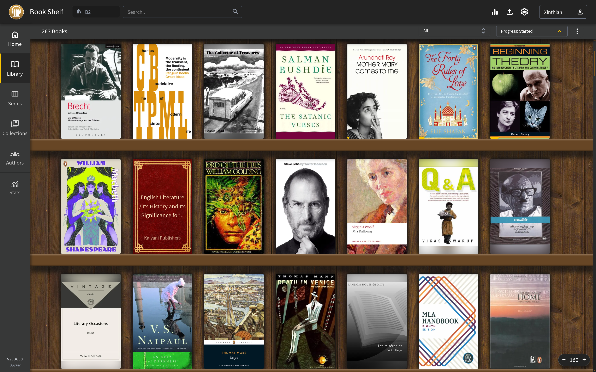
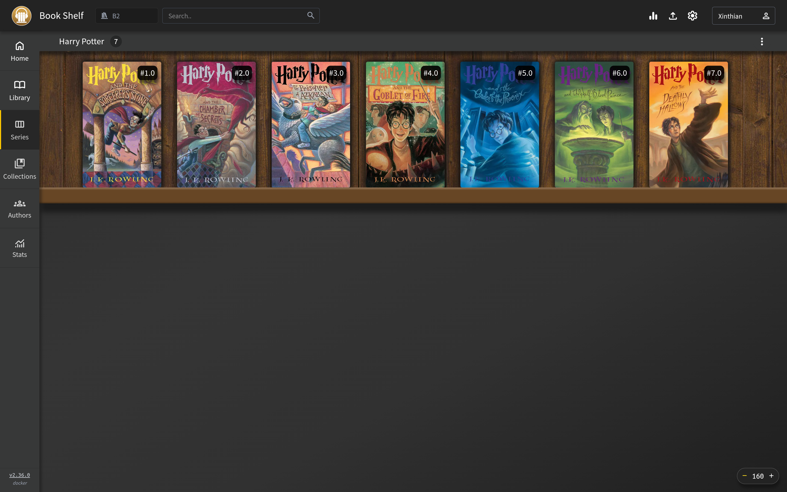
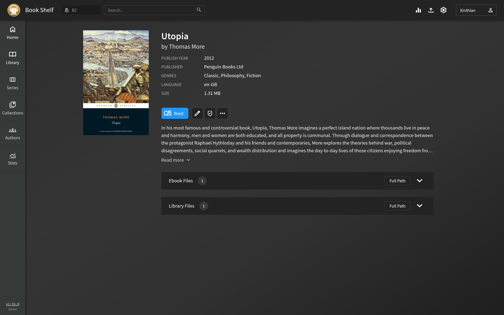
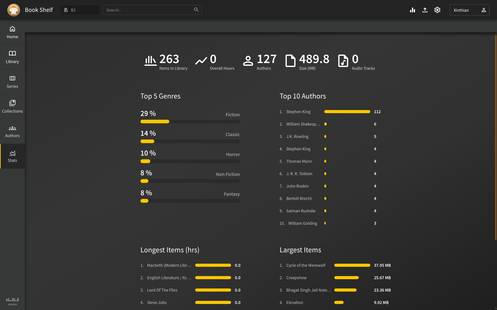

<p align="center">
  
</p>

<h1 align="center">Book Shelf</h1>

<p align="center">
  A private, self-hosted EPUB library and reader built for the web.<br>
  Read on desktop, iPhone, or iPad with highlights, notes, bookmarks, and progress kept in sync.
</p>

<p align="center">
  
  
  
  
</p>

<p align="center">
  
</p>

Book Shelf is an EPUB-focused fork of [Audiobookshelf](https://github.com/advplyr/audiobookshelf). It keeps Audiobookshelf's dependable library server and installable web app while tailoring the experience for reading rather than listening.

## Why this fork?

| Reading experience | Library experience |
| --- | --- |
| Synced highlights in four colours | Clean shelves with portrait covers |
| Notes and bookmarks stored on the server | Continue-reading and series shelves |
| Reliable highlight positions across devices | Author, collection, and statistics views |
| iPhone and iPad selection workflow | Responsive desktop, tablet, and mobile layouts |
| Fast Sans, Fast Serif, and Fast Mono | `Book Shelf` branding and an EPUB-first sidebar |
| Reader-only AMOLED, dark, sepia, and light themes | Persistent data in simple bind-mounted folders |

## The reader

AMOLED mode uses a true-black reading canvas, while Fast Fonts emphasize the opening portion of words to make long passages easier to scan. Theme, typeface, size, spacing, weight, and single/split-page layout remain reader-only preferences.

<p align="center">
  
</p>

## Mobile

The same server works as an installable web app on iPhone and iPad. Highlights, notes, bookmarks, and reading position follow the signed-in user between mobile and desktop.

<p align="center">
  
  &nbsp;
  
  &nbsp;
  
  &nbsp;
  
</p>

## Library views

<table>
  <tr>
    <td width="50%" align="center">
      <br>
      <sub>Browse and filter the complete library</sub>
    </td>
    <td width="50%" align="center">
      <br>
      <sub>Keep series together and in reading order</sub>
    </td>
  </tr>
  <tr>
    <td width="50%" align="center">
      <br>
      <sub>Metadata and reading controls in one place</sub>
    </td>
    <td width="50%" align="center">
      <br>
      <sub>Library statistics at a glance</sub>
    </td>
  </tr>
</table>

## Quick start with Docker Compose

### Requirements

- Docker with 64-bit AMD64 or ARM64 support
- Docker Compose v2

ARM64 is suitable for a Raspberry Pi running a 64-bit operating system.

```sh
git clone https://github.com/Xinthian/book-shelf.git
cd book-shelf
docker compose up -d --build
```

Open:

```text
http://YOUR_SERVER_IP:13378/audiobookshelf/
```

The first build compiles the server and web app, so it may take a few minutes on a Raspberry Pi.

To choose another host port:

```sh
BOOK_SHELF_PORT=8080 docker compose up -d --build
```

To stop the application:

```sh
docker compose down
```

## Start with Docker commands

If you prefer not to use Compose:

```sh
git clone https://github.com/Xinthian/book-shelf.git
cd book-shelf
mkdir -p books config metadata
docker build -t book-shelf:local .
docker run -d \
  --name book-shelf \
  --restart unless-stopped \
  -p 13378:80 \
  -e TZ=UTC \
  -v "$PWD/books:/books" \
  -v "$PWD/config:/config" \
  -v "$PWD/metadata:/metadata" \
  book-shelf:local
```

To stop and remove the container without deleting your library or application data:

```sh
docker stop book-shelf
docker rm book-shelf
```

## First-time setup

1. Open `http://YOUR_SERVER_IP:13378/audiobookshelf/`.
2. Create the administrator account.
3. Open settings and create a book library.
4. Select `/books` as the library folder.
5. Add EPUB files to the host-side `books` directory.

A predictable folder layout makes scans and metadata management easier:

```text
books/
└── Author name/
    └── Book title/
        └── Book title.epub
```

## Data and backups

| Host directory | Container path | Contents |
| --- | --- | --- |
| `books/` | `/books` | Your EPUB library |
| `config/` | `/config` | Database, users, progress, highlights, notes, and bookmarks |
| `metadata/` | `/metadata` | Covers and generated metadata |

These directories are ignored by Git. Back up all three, especially `config`, and never commit them to the repository.

## Updating

For a Compose installation:

```sh
git pull
docker compose up -d --build
```

For the Docker-command installation, pull the update, rebuild `book-shelf:local`, then recreate the container with the same bind mounts. Your data remains in the host directories.

## Project notes

- The app is served from the `/audiobookshelf/` base path.
- The repository contains application source and deployment files only—no books, user database, or personal metadata.
- This is a personal EPUB-focused fork, not an official Audiobookshelf release.

## Upstream and license

Book Shelf is based on [Audiobookshelf](https://github.com/advplyr/audiobookshelf), created by the Audiobookshelf contributors. The project remains licensed under [GPL-3.0](LICENSE).
